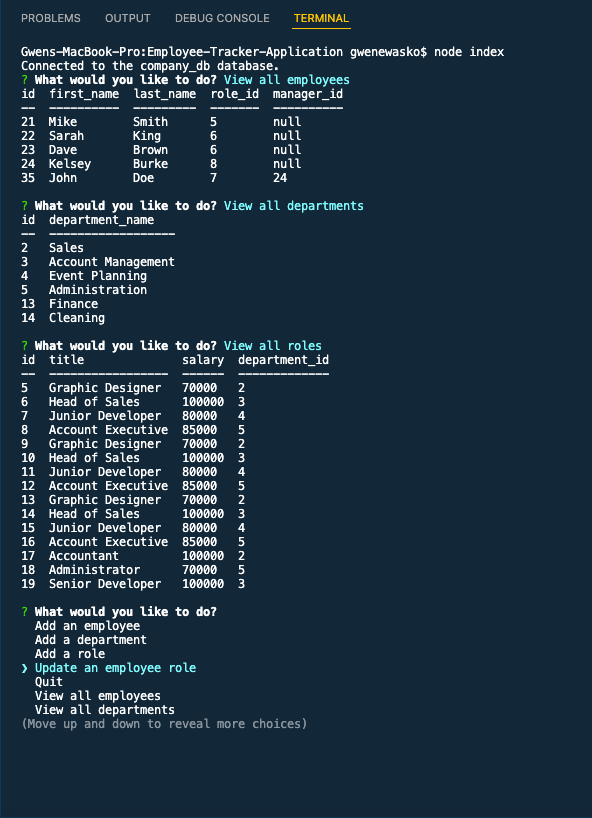
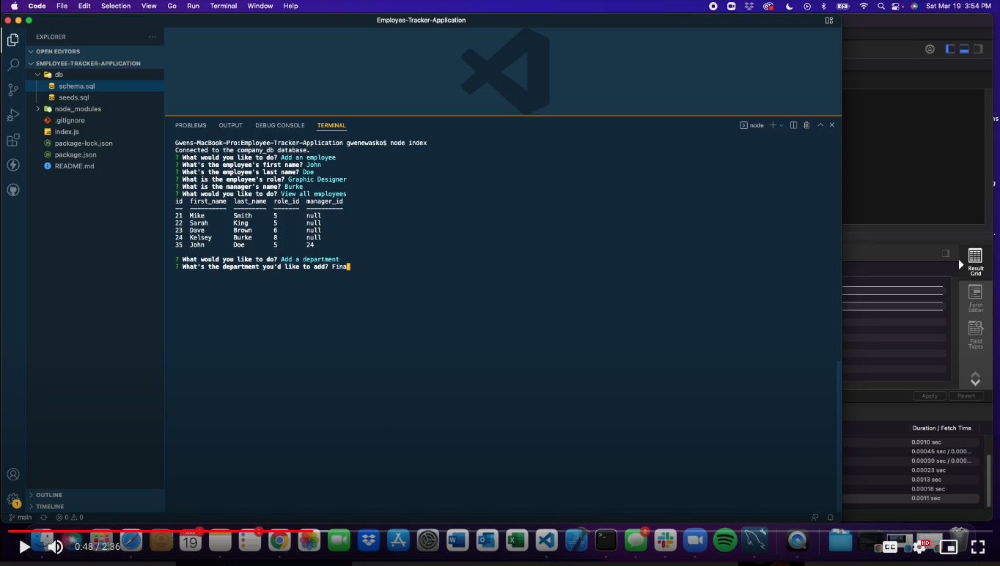

# 13 Employee Tracker Application

## Description:
I have developed an employee tracker application in mySQL which allows users to add and view 3 seperate database tables -- employees, roles and departments.

When a user starts my application they will see a list of options in thier terminal which include adding, viewing and updating.
When they choose "View Employees" a table generates in the terminal of their employees with thier employee id number, and thier manager id number.
When they choose to "View All Roles" a table generates in the terminal with thier created roles including the role name, salary for that role and the department associated with that role.
When they choose "Add a Role" they will enter in the new role name and that will be added to the roles database.
When they choose "Add an Employee" they will enter in the new employee's first and last name, thier title, and who thier manager is.
When they choose "Add a Department" they will enter in the new department name which will then be added to the department table.
When they choose to "Update an Employee Role" they will be choose which active employee they would like to update, and then they will choose which active role they would like to update that employee to and then that change will be reflected in the employee table.

## Screenshot:

## Walkthrough Video:
[(https://drive.google.com/file/d/1xmPoIETgkW9mDVuHr63SXuxNdLmWJEaD/view?usp=sharing)

## Link to Repo:
[gwenewasko/repo](https://github.com/gwenewasko/Employee-Tracker-Application)
